<br>
<hr/><br/>

> D105 酒酒CLUB 특화 PJT / 빅데이터 추천 Track<br/>
> 2024.08.26 ~ 2024.10.11 (7주)<br/>
> 🔗 **[NewLearn](https://j11d105.p.ssafy.io/) 바로가기<br/>**

### 📌 Contents
 1. [Overview](#Overview)
 2. [기능 소개](#기능_소개)
 3. [기술 스택](#기술_스택)
 4. [주요 기술](주요_기술)
 5. [시스템 아키텍처](#시스템_아키텍처)
 5. [산출물](#산출물)
 6. [팀원 소개](#팀원_소개)
 7. [Conventions](#Conventions)

## Overview
🗣 처음 시작하기 어려운 영어 공부, 재미있게 할 방법이 없을까?<br/>
영어로 뉴스를 읽으며 즐겁게 학습해보는건 어떤가요?<br/>
최신 국내 뉴스와 함께 영어를 쉽게 공부할 수 있는 곳, **New Learn**🙌🏻

## 기능 소개

### 1) 회원가입 & 로그인
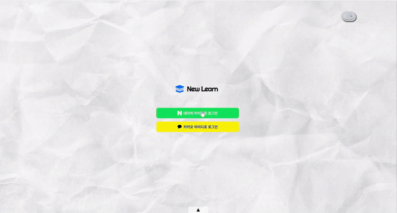<br/><br/>

### 2) 튜토리얼
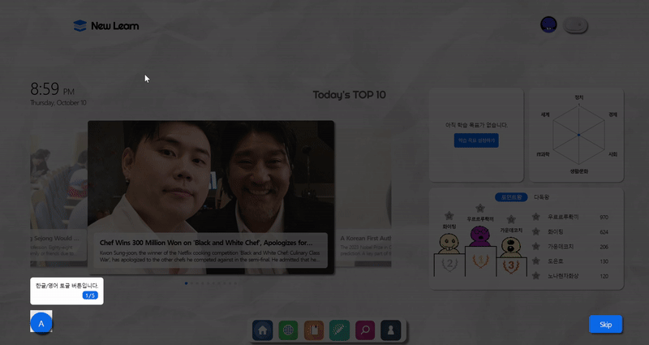<br/><br/>

### 3) 메인 페이지
<br/><br/>

### 4) 라이트/다크모드
<br/><br/>


### 5) 뉴스 페이지
#### ✔ 뉴스 전체 목록
<br/>

#### ✔ 뉴스 상세
<br/>
<br/>
<br/>

#### ✔ 단어 하이라이팅
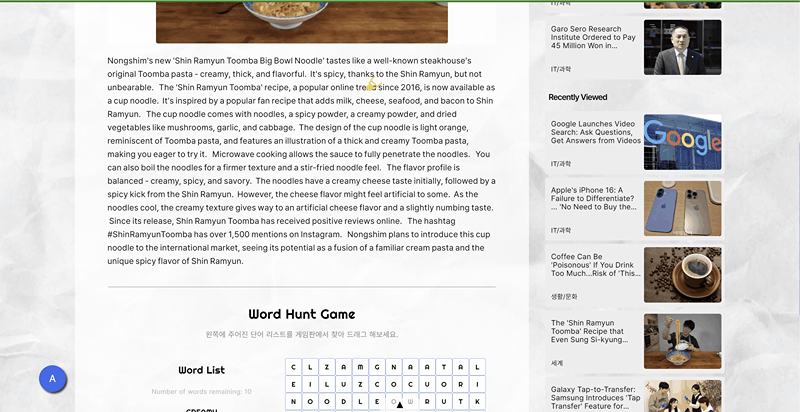<br/>

#### ✔ 뉴스 스크랩
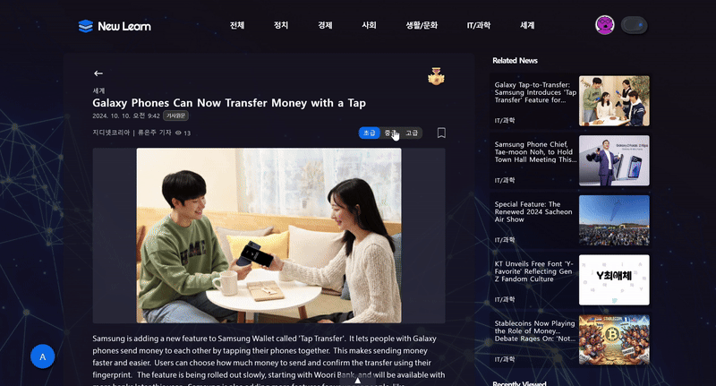<br/>

#### ✔ Word hunt game
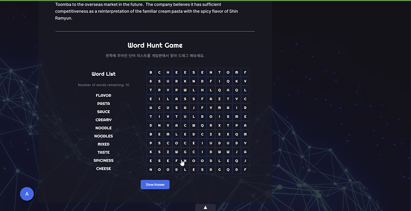<br/>
<br/>


### 6) 나만의 단어장
#### ✔ 단어 목록
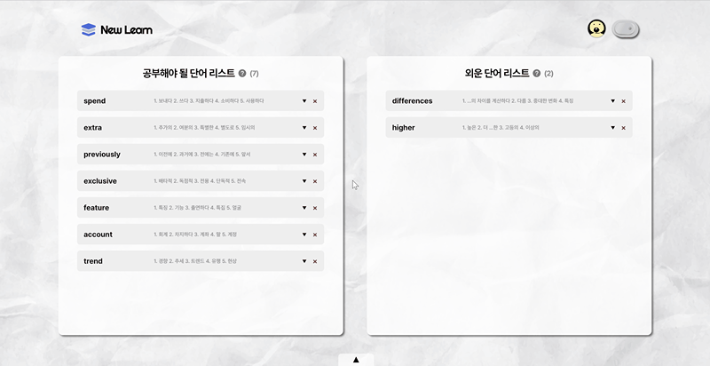<br/>

#### ✔ 단어 외움 처리
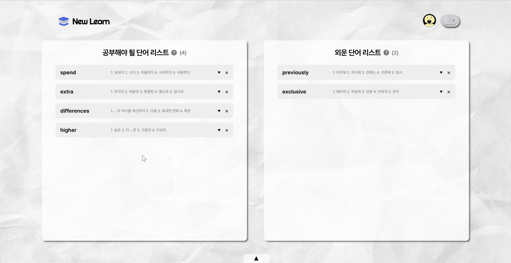<br/>

#### ✔ 망각 곡선 기반 단어 복습


### 7) 학습 목표 및 경험치
#### ✔ 학습 목표 설정
<br/>

#### ✔ 경험치 획득
<br/>


### 8) 단어 빈칸 테스트
#### ✔ 테스트 시작
<br/>

#### ✔ 테스트 결과


### 9) 발음 테스트
#### ✔ 테스트 시작

#### ✔ 테스트 결과


### 10) 검색 페이지
#### ✔ Wordcloud 기반 인기 키워드 검색<br/>
<br/><br/>


### 11) 마이페이지
<br/><br/>


### 12) PWA (Progressive Web Apps)
|메인 페이지|나만의 단어장|마이 페이지|
|:---:|:---:|:---:|
 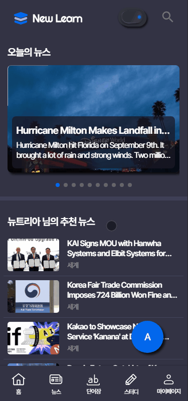|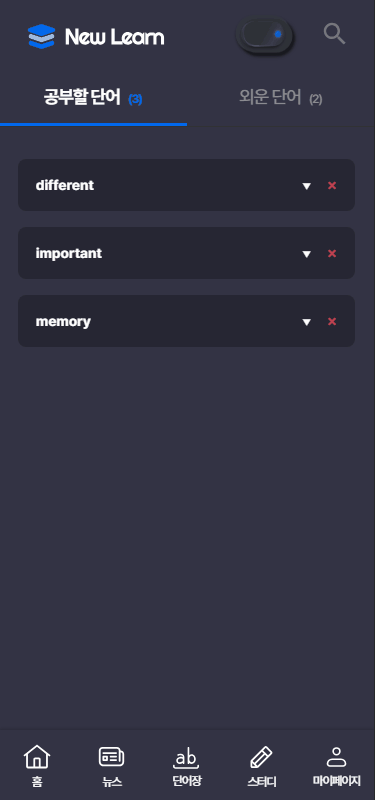|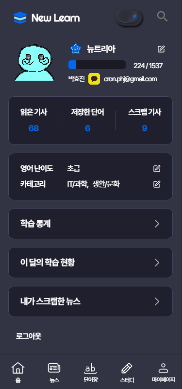|
 
|뉴스 전체 목록|뉴스 상세|
|:---:|:---:|
 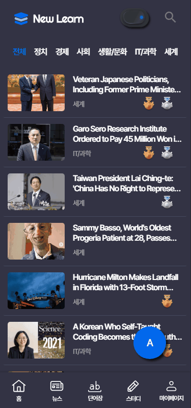|

|단어 빈칸 테스트 시작|단어 빈칸 테스트 진행|단어 빈칸 테스트 결과|
|:---:|:---:|:---:|
 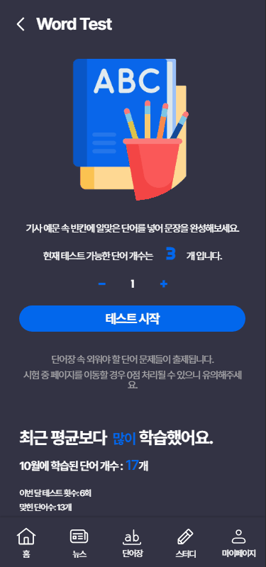|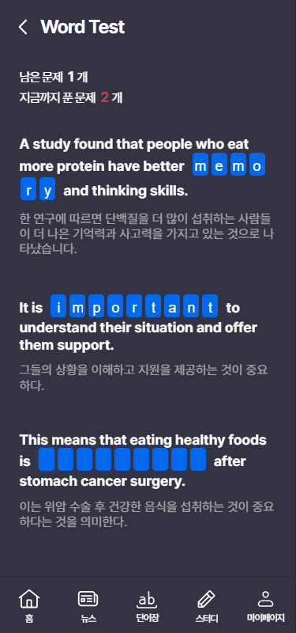|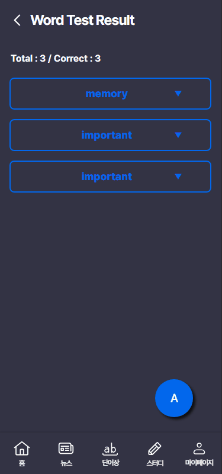|

|발음 테스트 시작|발음 테스트 진행|발음 테스트 결과|
|:---:|:---:|:---:|
 |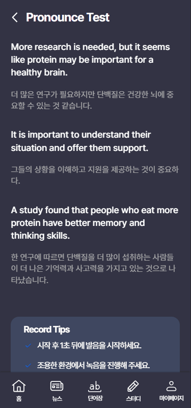|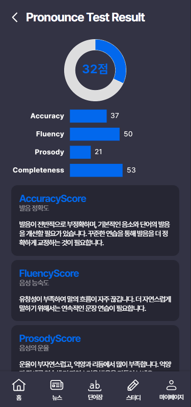|

## 기술 스택
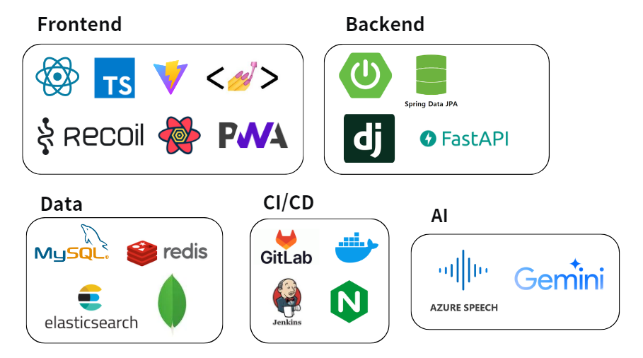<br>

## 주요 기술
- **데이터 파이프라인 구축**
  - 각 데이터베이스의 특성을 고려한 멀티 데이터베이스 아키텍처 설계<br/>
  - 대용량 데이터 백업을 위한 효율적인 아키텍처 설계<br/>
  - APScheduler를 활용한 데이터 수집 프로세스 자동화<br/>
  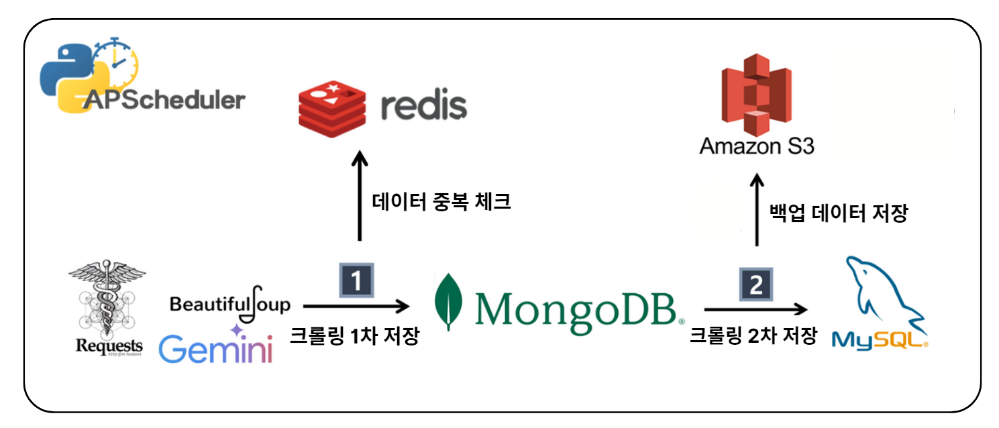
  
- **하이브리드 추천 시스템**
  - **Cold Start 문제 해결**을 위한 협업 필터링(CF) 및 컨텐츠 기반 필터링(CBF) 결합<br/>
  - 사용자 행동 데이터 기반 유사도 계산<br/>
  - KoNLPy 기반 형태소 분석 및 TF-IDF 매트릭스 구축<br/>
  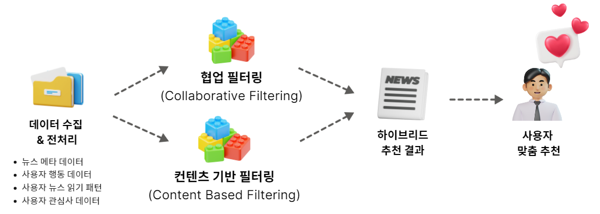

- **Elasticsearch 기반 검색**
  - 뉴스 기사 검색 기능 최적화<br/>
  - 역 인덱스 활용한 데이터 처리 및 검색 기능 제공<br/>
  

- **Blue/Green 무중단 배포 전략**
  - 애플리케이션의 두 개의 환경(Blue와 Green)을 활용하여<br/> 서비스의 가용성과 안정성을 높이는 배포 방식

## 시스템 아키텍처
<br>

## 산출물
| 종류 | 바로가기 |
| --- | --- |
| 기능 명세서 | [📝 기능 명세서](https://lying-sled-191.notion.site/5e288e4a2209420fa506f1a272651ff4?v=a656c43b335645cab41381e6631526f7) |
| API 명세서 | [📡 API 명세서](https://lying-sled-191.notion.site/API-8cd85d9441604e6fa374fe29dc34970a) |
| 와이어 프레임 | [🎨 와이어 프레임](https://www.figma.com/design/fwwTElvwSVoxJu1kZyvE0P/NewLearn?node-id=0-1&m=dev) |
| E-R Diagram | [🖥️ E-R Diagram](https://www.erdcloud.com/d/aGzLSJQJ94mt3ZTgA)         
| 포팅 매뉴얼 | [🔍 포팅 매뉴얼](./exec/D105_NEWLEARN_포팅메뉴얼.pdf) |
| 시연 시나리오 | [🎬 시연 시나리오](./exec/D105_NEWLEARN_시연시나리오.pdf) |
| Postman 문서 | [📜 Postman 문서](https://documenter.getpostman.com/view/34463295/2sAXxQfCqB) |
| 최종 발표 자료 | [📊 최종 발표 자료](https://www.canva.com/design/DAGS_f7KERU/yNVr2LT_-nCfHfwO0pGKxw/edit?utm_content=DAGS_f7KERU&utm_campaign=designshare&utm_medium=link2&utm_source=sharebutton) | |


## 팀원 소개
#### 🔥 酒酒CLUB

|**[이예찬]()**|**[김수정]()**|**[노나현]()**|**[박효진]()**|**[손민락]()**|**[허세령]()** |
| :---------------------------------------------------------------------------------------------------------------------------: | :---------------------------------------------------------------------------------------------------------------------------: | :---------------------------------------------------------------------------------------------------------------------------: | :---------------------------------------------------------------------------------------------------------------------------: | :---------------------------------------------------------------------------------------------------------------------------: | :---------------------------------------------------------------------------------------------------------------------------: |
|Leader & Backend|Backend|Backend|Frontend|Frontend|Frontend|
<!-- |  |  |  |  |  |  | -->


## Conventions
```
[FEAT] 새로운 기능 구현
[FIX] 버그, 오류 수정
[DOCS] README나 WIKI 등의 문서 개정
[STYLE] 스타일 관련 기능
[REFACTOR] 코드 리팩토링
[TEST] 테스트 코드 추가
[CHORE] 빌드 업무 수정, 패키지 매니저 수정
[Comment] 필요한 주석 추가 및 변경
[Rename]  파일 또는 폴더 명을 수정하거나 옮기는 작업만인 경우 
[Remove] 파일을 삭제하는 작업만 수행한 경우
[!BREAKING CHANGE] 커다란 API 변경의 경우
[!HOTFIX] 급하게 치명적인 버그를 고쳐야 하는 경우
```
