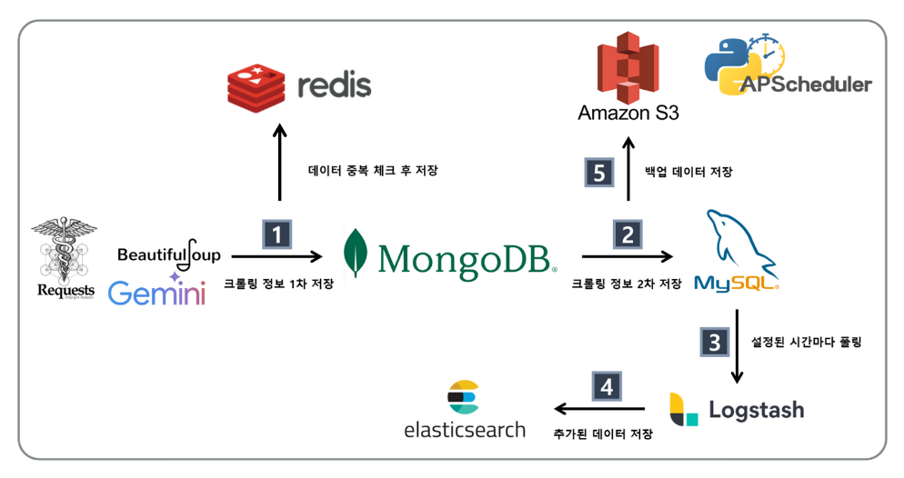
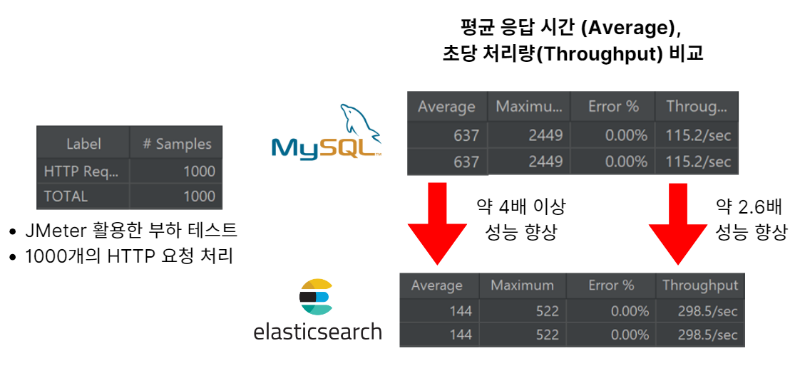

<br>
<hr/><br/>

> D105 酒酒CLUB 특화 PJT / 빅데이터 추천 Track<br/>
> 2024.08.26 ~ 2024.10.11 (7주)<br/>

🔗 **서비스 URL  /  [NewLearn](https://i11d205.p.ssafy.io/)<br/>**
🔗 **서비스 소개 영상  /  ["NewLearn" UCC]()<br/>**

최신 뉴스 기사를 통해 영어를 배우고, 실질적인 지식과 정보를 습득하자!<br/>
국내 뉴스 기반 영어 학습 플랫폼, **New Learn** ✨<br/>

### 📌 Contents
 1. [서비스 소개](#서비스_소개)
 2. [주요 기능](#주요_기능)
 3. [개발 환경](#개발_환경)
 4. [기술 특이점](#기술_특이점)
 5. [산출물](#산출물)
 6. [Conventions](#Conventions)
 7. [팀원 소개](#팀원_소개)

## 서비스 소개
처음 시작하기 어려운 영어 공부, 재미있게 할 방법이 없을까요?<br/>
영어로 뉴스를 읽으며 즐겁게 학습해보는건 어떤가요?<br/>
최신 국내 뉴스와 함께 영어를 쉽게 공부할 수 있는 곳, **New Learn**🙌🏻

## 주요 기능
- 회원가입 / 로그인
- 뉴스
- 단어 빈칸 테스트
- 발음 테스트
- 검색 / WordCloud
- 마이페이지

## 개발 환경
<br>

## 기술 특이점
- **데이터 파이프라인 구축**
  - 각 데이터베이스의 특성을 고려한 멀티 데이터베이스 아키텍처 설계
  - 대용량 데이터 백업을 위한 효율적인 아키텍처 설계
  - APScheduler를 활용한 데이터 수집 프로세스 자동화
  
  
  
- **하이브리드 추천 시스템**
  - **Cold Start 문제 해결**을 위한 협업 필터링(CF) 및 컨텐츠 기반 필터링(CBF) 결합
  - 사용자 행동 데이터 기반 유사도 계산
  - KoNLPy 기반 형태소 분석 및 TF-IDF 매트릭스 구축
  

- **Elasticsearch 기반 검색**
  - 뉴스 기사 검색 기능 최적화
  - 역 인덱스 활용한 데이터 처리 및 검색 기능 제공
  

- **Blue/Green 무중단 배포 전략**
  - 애플리케이션의 두 개의 환경(Blue와 Green)을 활용하여<br/> 서비스의 가용성과 안정성을 높이는 배포 방식

## 프로젝트 산출물
✔ [기능 명세서](https://lying-sled-191.notion.site/5e288e4a2209420fa506f1a272651ff4?v=a656c43b335645cab41381e6631526f7)

✔ [API 명세서](https://lying-sled-191.notion.site/API-8cd85d9441604e6fa374fe29dc34970a)

✔ [와이어 프레임](https://www.figma.com/design/fwwTElvwSVoxJu1kZyvE0P/NewLearn?node-id=0-1&m=dev)

✔ [E-R Diagram](https://www.erdcloud.com/d/aGzLSJQJ94mt3ZTgA)

✔ [시스템 아키텍처](./resources/system_architecture.png)

✔ [최종 발표 자료]()

✔ [포팅 매뉴얼]()

✔ [시연 시나리오]()

✔ [Postman 문서](https://documenter.getpostman.com/view/34463295/2sAXxQfCqB)

## Conventions
```
[FEAT] 새로운 기능 구현
[FIX] 버그, 오류 수정
[DOCS] README나 WIKI 등의 문서 개정
[STYLE] 스타일 관련 기능
[REFACTOR] 코드 리팩토링
[TEST] 테스트 코드 추가
[CHORE] 빌드 업무 수정, 패키지 매니저 수정
[Comment] 필요한 주석 추가 및 변경
[Rename]  파일 또는 폴더 명을 수정하거나 옮기는 작업만인 경우 
[Remove] 파일을 삭제하는 작업만 수행한 경우
[!BREAKING CHANGE] 커다란 API 변경의 경우
[!HOTFIX] 급하게 치명적인 버그를 고쳐야 하는 경우
```

## 팀원 소개
##### 🔥 `酒酒CLUB` 팀원들을 소개합니다!

|**[이예찬]()**|**[김수정]()**|**[노나현]()**|**[박효진]()**|**[손민락]()**|**[허세령]()** |
| :---------------------------------------------------------------------------------------------------------------------------: | :---------------------------------------------------------------------------------------------------------------------------: | :---------------------------------------------------------------------------------------------------------------------------: | :---------------------------------------------------------------------------------------------------------------------------: | :---------------------------------------------------------------------------------------------------------------------------: | :---------------------------------------------------------------------------------------------------------------------------: |
|Leader & Backend|Backend|Backend|Frontend|Frontend|Frontend|
<!-- |  |  |  |  |  |  | -->


 

